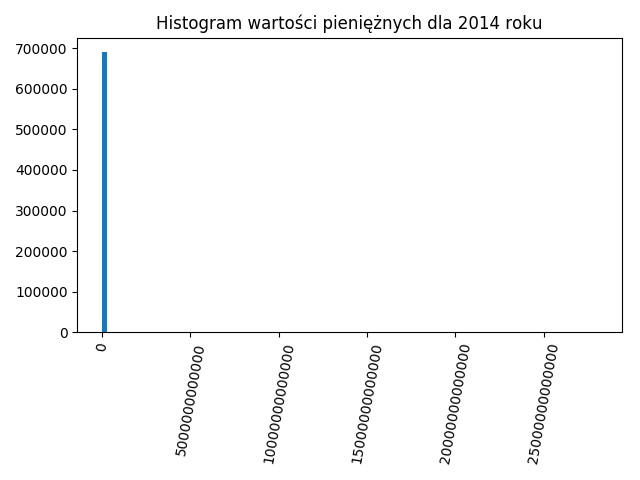
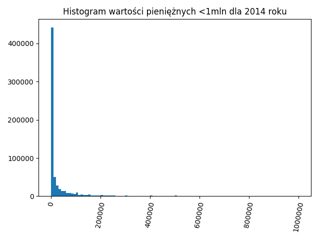
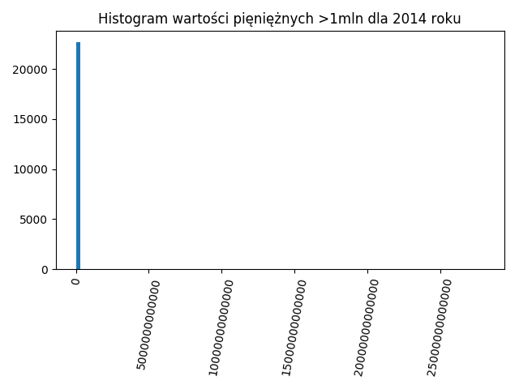

Do zadania 1. i 2. wykorzystano skrypty _findMoney.py_ i _drawHist.py_, do zadania 3. _findArt455.py_, a do 4. _findSzkoda.py_. Skrypty wymagają biblioteki _matplotlib_.

1.

2.

3.
Liczba orzeczeń odwołujących się do artykułu 445: 2462

4.
Liczba orzeczeń ze słowem "szkoda": 17121