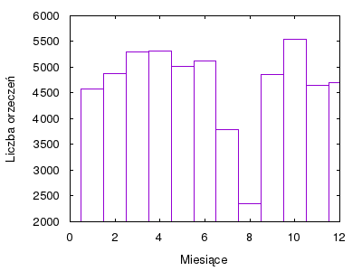

Wymagania do uruchomienia skryptów: npm, node, gnuplot

Uruchomienie:
```bash
npm install
node init.js NAZWA_INDEXU [ŚCIEŻKA_DO_ORZECZEŃ]
node getResults.js NAZWA_INDEXU
```

ElasticSearcha skonfigurowano następującym jsonem:

```javascript
PUT NAZWA_INDEXU

{
	"settings": {
		"analysis" : {
			"analyzer" : {
				"zad2analyzer" : {
					"type" : "custom",
					"tokenizer": "standard",
					"filter": [
						"lowercase",
						"morfologik_stem"
						]
				}
			}
		}
	},
	"mappings" : {
		"doc" : {
			"properties" : {
				"judgmentText" : {
					"type": "text",
                    "analyzer": "zad2analyzer"
				},
				"judgmentDate" : {
					"type": "date",
					"format": "yyyy-MM-dd"
				},
				"judges" : {
					"type": "keyword"
				},
				"signature": {
					"type": "keyword"
				}
			}
		}
	}
}


```
Json ten był wysyłany za pomocą init.js

Wynik zadań 6-9:

```javascript
6. Orzeczeń ze słowem "szkoda": 17263
7. Orzeczeń z "trwałym uszczerbkiem na zdrowiu": 1386
8. Orzeczeń z "trwałym uszczerbkiem na zdrowiu" z max. 2 wyrazową przerwą: 1478
9. Sędziowie z największą liczbą orzeczeń:
        1) Beata Górska: 411
        2) Anna Polak: 348
        3) Roman Troll: 338

```

Histogram dla zadania 10:



Jsony dla zadań 6-10:

```javascript
6. POST NAZWA_INDEXU/_count

{
    "query": {
        "match": {
            "judgmentText": "szkoda"
        }
    }
}

7. POST NAZWA_INDEXU/_count

{
    "query": {
        "match_phrase": {
            "judgmentText": {
                "query": "trwały uszczerbek na zdrowiu"
            }
        }
    }
}

8. POST NAZWA_INDEXU/_count

{
    "query": {
        "match_phrase": {
            "judgmentText": {
                "query": "trwały uszczerbek na zdrowiu",
                "slop": 2
            }
        }
    }
}

9. POST NAZWA_INDEX/_search

{
    "aggs": {
        "top_judges": {
            "terms": {
                "field": "judges",
                "size": 3
            }
        }
    },
    "size": 0
}

10. POST NAZWA_INDEX/_search

{
    "aggs" : {
        "judgments": {
            "date_histogram": {
                "field": "judgmentDate",
                "interval": "month"
            }
        }
    },
    "size": 0
}

```
