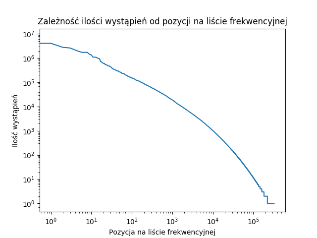

Skrypt *splitter.py* służy do stworzenia listy frekwencyjnej i umieszczenia jej w pliku *ranking.txt*.

Następnie *plotter.py* tworzy wykres wystąpień danego słowa od jego pozycji na liście frekwencyjnej przedstawiony poniżej:



Skrypt *findNonexistent.py* znajduje wyrazy z listy frekwencyjnej i zapisuje je do pliku *nonExistent.txt*. Z tego pliku wybrano 30 słów do pliku *30words.txt*.

Następnie za pomocą skryptu *findCorrections.py* próbowano znaleźć poprawne słowa maksymalnie do 2 odległości Levenshteina. Wynik przedstawiono poniżej:

```
potrwierdzone >>> potwierdzone in distance1
kontytuowaniu >>> kontynuowaniu in distance1
szcowania >>> szacowania in distance1
męzczyzną >>> mężczyzną in distance1
oprogramwoania >>> oprogramowania in distance2
objerzeniu >>> objedzeniu in distance1
odwołaniai >>> odwołania in distance1
miedzynarodowej >>> międzynarodowej in distance1
ucieplone >>> ocieplone in distance1
czoworokowania >>> ???
równierz >>> również in distance2
przyszłośści >>> przyszłości in distance1
równeiż >>> również in distance2
przeszkukania >>> przeszukania in distance1
uzyskanai >>> uzyskana in distance1
wlasnymi >>> własnymi in distance1
neurochirigiczna >>> neurochirurgiczna in distance2
nerorozwojowej >>> ???
związaku >>> związku in distance1
ustalalono >>> ustalono in distance2
obiwązek >>> obowiązek in distance2
oaskarażonemu >>> oskarżonemu in distance2
nastraszania >>> zastraszania in distance1
czynnośći >>> czynności in distance1
odnawialnm >>> odnawialny in distance1
póżniejszych >>> późniejszych in distance1
nstytucja >>> instytucja in distance1
azebejdżan >>> azerbejdżan in distance1
śwaidak >>> świda in distance2
pozwanenej >>> pozwanej in distance2
```

W słowniku nie znajdowały się wszystkie słowa, np. *czworakowania*. Dodatkowo można zauważyć błędnie poprawione słowa - *śwaidak* powinno być poprawione na *świadka*, jednak do tego słowa jest aż 4 odległości Levenshteina. Dodatkowo *odnawialnm* powinno być poprawione na *odnawialnym*, a *uzyskanai* na *uzyskania*. Dodatkowo *nastraszania* jest poprawnym słowem, którego po prostu nie ma w słowniku i zostało poprawione na takie, które już w słowniku jest.