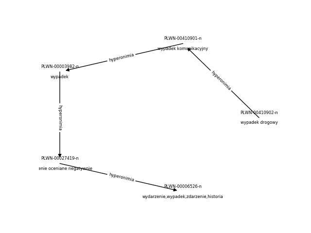
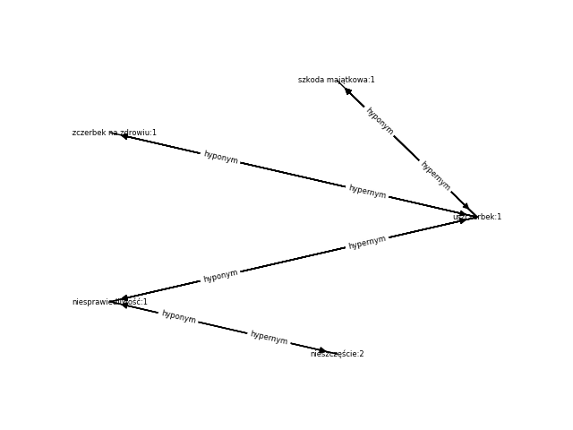
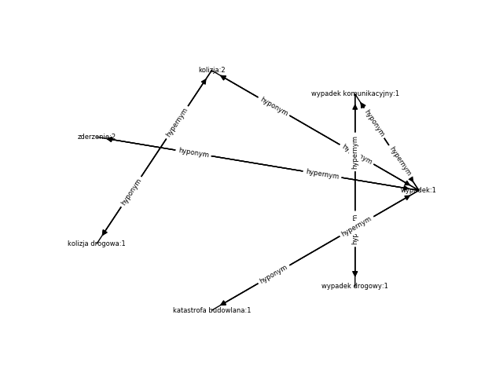

Zad 3. "szkoda":

Znaczenie: 
Synonimy: strata, utrata, szkoda, uszczerbek

Znaczenie: brak danych
Synonimy: szkoda
Zad 4. "wypadek drogowy":

Zad 5. wypadek:1

Hiponimie 1 rzędu:

PLWN-00001284-n: zderzenie,kraksa
PLWN-00006486-n: kolizja
PLWN-00016131-n: karambol
PLWN-00034688-n: zawał
PLWN-00034689-n: tąpnięcie
PLWN-00241026-n: kapotaż
PLWN-00258639-n: wykolejenie
PLWN-00389170-n: zakrztuszenie,zachłyśnięcie,aspiracja
PLWN-00410901-n: wypadek komunikacyjny
PLWN-00411618-n: katastrofa budowlana
PLWN-00436137-n: wypadek jądrowy

Zad 6. cd wypadek:1

Hiponimie 2 rzędu:

PLWN-00235346-n: czołówka,zderzenie czołowe
PLWN-00471555-n: stłuczka
PLWN-00441365-n: kolizja drogowa
PLWN-00037295-n: obwał
PLWN-00410902-n: wypadek drogowy

Zad 7.

Brakowało słowa "bezkolizyjny" w SłowoSieci.

Zad 8.

WNQuery.simLeaCho(szkoda,wypadek)=1.000
my_lea_cho_fixed(szkoda,wypadek)=2.367
WNQuery.simLeaCho(kolizja,szkoda majątkowa)=0.824
my_lea_cho_fixed(kolizja,szkoda majątkowa)=1.856
WNQuery.simLeaCho(nieszczęście,katastrofa budowlana)=0.648
my_lea_cho_fixed(nieszczęście,katastrofa budowlana)=1.735
