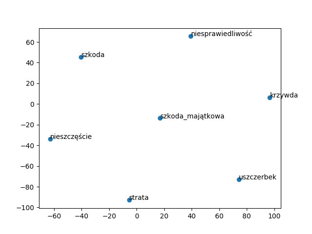

## Zad 7
#### sąd_najwyższy:
	trybunał_konstytucyjny: 0.7232486009597778
	trybunał: 0.7014943361282349
	sn: 0.6869748830795288
#### trybunał_konstytucyjny:
	trybunał: 0.9019451141357422
	prokurator_generalny: 0.7536938190460205
	marszałek_sejmu: 0.726771354675293
#### kodeks_cywilny:
	kodeks_pracy: 0.8194487690925598
	kodeks_karny: 0.7616890668869019
	kodeks_wykroczeń: 0.7161792516708374
#### kpk:
	kpc: 0.7546005249023438
	kpw: 0.753844141960144
	kpa: 0.7016794681549072
#### sąd_rejonowy:
	sad_rejonowy: 0.8421956896781921
	sąd_okręgowy: 0.7745794057846069
	sad_okręgowy: 0.7531156539916992
#### szkoda:
	krzywda: 0.7871027588844299
	szkoda_majątkowa: 0.7441856861114502
	szkoda_ta: 0.730417013168335
#### wypadek:
	przypadek: 0.6213768720626831
	spowodowanie: 0.5868521928787231
	moment: 0.5497691631317139
#### kolizja:
	interwencja_policji: 0.724856436252594
	awantura: 0.6962530612945557
	operacja: 0.689591646194458
#### szkoda_majątkowa:
	krzywda: 0.7448480129241943
	szkoda: 0.7441856861114502
	szkoda_niemajątkowa: 0.740683913230896
#### nieszczęście:
	wyjątkowe_okoliczności: 0.40223532915115356
	pogorszenie_lub: 0.38738813996315
	precedensowy_charakter: 0.386245459318161
#### rozwód:
	separację: 0.6451466083526611
	przez_rozwód: 0.6023476123809814
	rozwiązanie_małżeństwa: 0.5884369611740112
## Zad 8
#### sąd_najwyższy - kpc + konstytucja
	sn: 0.5813509225845337
	trybunał: 0.5605523586273193
	trybunał_sprawiedliwości: 0.5552694797515869
	trybunał_konstytucyjny: 0.5342593193054199
	prawodawca: 0.5187748670578003
#### pasażer - mężczyzna + kobieta
	piesza: 0.712666392326355
	pasażerka: 0.6928448677062988
	żona_powoda: 0.636249840259552
	odniosła_obrażenia: 0.6163632869720459
	jazda: 0.6120914816856384
#### samochód - droga + rzeka
	pałkę: 0.6672862768173218
	schodek: 0.6539697647094727
	nogi_taśmą: 0.6538220643997192
	spożyty_alkohol: 0.6450977921485901
	szalik: 0.6419984698295593
## Zad 9

